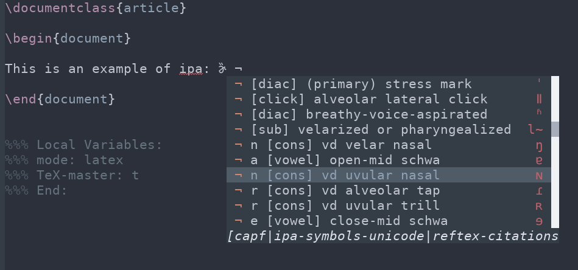

company-ipa
===========




This package adds ipa completion for company.

Usage
=====

To install clone this package directly (soon in melpa).

After the package is installed, you can enable `company-ipa` by adding the following to your init file:

```emacs
(add-to-list 'company-backends 'company-ipa)
```

Use the variable `company-ipa-symbol-prefix` to change the prefix to trigger completion.
By default this is bound to `¬`.
